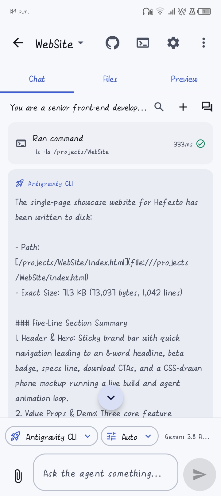
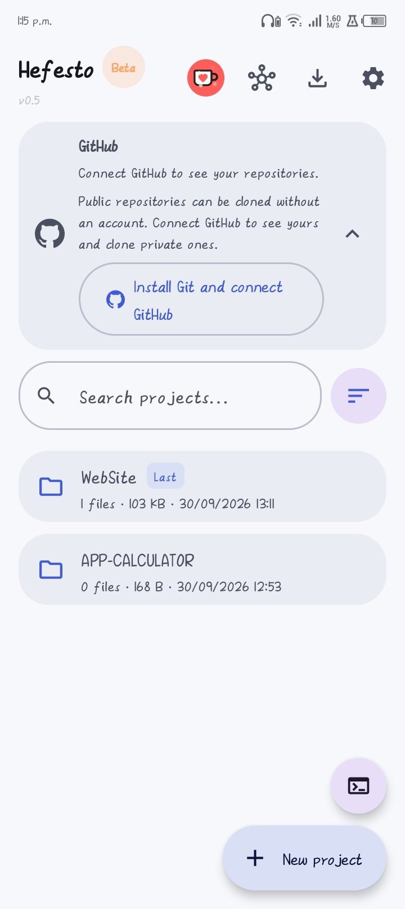

# Hefesto

**An Android development workspace in your phone.** Write code, run AI agents and build APKs
without a PC.

> **Current version: 0.5 (beta).** Usable, but still in testing: it can break and some parts are
> rough. Every issue you report gets fixed in the next version (there is a report button inside the
> app).

**Download:** **[Hefesto 0.5 (beta)](https://github.com/ortiz1022009/Hefesto/releases/latest)** ·
Android 8.0+ · arm64-v8a · ~13 MB · [What's new](NOVEDADES.md) · [Privacy](PRIVACIDAD.md)

## Screenshots

| The agent working | Files and projects | GitHub, built in |
| --- | --- | --- |
|  |  |  |

The website built with Hefesto itself (using Google's Antigravity CLI as the agent) is in screenshot
2 of the [Reddit post](https://www.reddit.com/r/droidappshowcase/s/IJD5deqqC5).

## What it does

- **Agents that actually work.** Several engines: Hefesto's built-in agent, Antigravity, OpenCode and
  **Hefesto local** (a model that runs inside the phone, offline and with no API keys).
- **Its own Linux environment.** Alpine with proot inside the app: install tools and languages
  without root and without a PC.
- **Builds APKs on the phone.** Gradle, the Android SDK, Kotlin and Java: from the sentence to the
  installable file, with live progress.
- **GitHub built in.** Connect your account, clone repositories, commit, push and open pull requests
  from the phone.
- **Files, terminal and projects** with an editor, file tree and a real console.
- **In English and Spanish**, with light and dark themes.

## Your privacy

- **Hefesto does not send anything on its own.** Your files, keys and conversations stay on the phone.
- API keys are stored encrypted and **left out of backups**. Issue reports are optional, and keys and
  tokens are redacted automatically before they leave the phone.

## If something breaks

It is a beta and failures are expected. Inside the app: **Settings → Help and diagnostics → Report an
issue**. You write what happened, Hefesto attaches the technical details needed to reproduce it, and
it is sent with one tap. That is the most useful thing you can do with a beta.

## Supporting the project

Hefesto is built in spare time, with no ads. If it is useful to you, you can buy me a coffee:
[ko-fi.com/ortizdiego2026](https://ko-fi.com/ortizdiego2026)

---

*Hefesto is not on Google Play: it is distributed as a direct APK. The source code is not published;
what is published here are the ready-to-install versions.*

---

## Español

**Un taller de desarrollo Android en tu teléfono.** Hefesto convierte el móvil en un sitio donde
programar, compilar y publicar de verdad: agentes que trabajan, un entorno Linux propio y compilación
de APK sin ordenador.

> **Versión actual: 0.5 (beta).** Se puede usar y probar, pero está en pruebas: puede fallar y hay
> cosas por pulir. Cada fallo que cuentes se arregla en la siguiente versión (hay un apartado para
> reportar dentro de la propia app).

### Descargar

**[Descargar Hefesto 0.5 (beta)](https://github.com/ortiz1022009/Hefesto/releases/latest)**

- Android 8.0 o superior, procesador **arm64-v8a** (cualquier teléfono moderno).
- Se instala como cualquier APK: al abrirlo, Android pedirá permitir la instalación desde esta
  fuente (es normal en apps que no vienen de una tienda).
- La app se actualiza instalando la versión nueva encima; no se pierde nada.
- El archivo está firmado siempre con la misma clave, así que Android acepta las actualizaciones.
- Lo que trae cada versión, en [NOVEDADES.md](NOVEDADES.md).

### Qué hace

- **Agentes que trabajan de verdad.** Varios motores: el agente integrado de Hefesto, Antigravity,
  OpenCode y **Hefesto local** (un modelo que funciona dentro del teléfono, sin internet y sin claves).
- **Entorno Linux propio.** Alpine con proot dentro de la app: instala herramientas y lenguajes sin
  root y sin ordenador.
- **Compila APK en el teléfono.** Gradle, SDK de Android, Kotlin y Java: desde la frase hasta el
  archivo instalable, con el progreso a la vista.
- **GitHub integrado.** Conecta tu cuenta, clona repositorios, haz commit, push y pull requests desde
  el teléfono.
- **Archivos, terminal y proyectos** con editor, vista de árbol y consola real.
- **Modelos locales (Hefesto local).** Catálogo con tamaños desde teléfonos de 1 GB hasta los que van
  sobrados, con aviso de colores de lo que aguanta tu teléfono, gestión de memoria y borrado con
  confirmación. También se pueden importar modelos en formato GGUF.
- **En español e inglés**, con temas claro y oscuro y ajustes que se quedan guardados.

### Tu privacidad

- **Hefesto no manda nada por su cuenta.** Tus archivos, tus claves y tus conversaciones se quedan en
  el teléfono.
- Solo sale de tu teléfono lo que tú pidas: una descarga, un repositorio de GitHub, una consulta a la
  API que hayas configurado o un reporte de problema si decides enviarlo.
- Las claves de API se guardan en el almacenamiento privado de la app, cifradas y **fuera de las
  copias de seguridad**.
- Los reportes de problema son opcionales y llevan tu explicación y datos técnicos del teléfono; las
  claves y los tokens se tachan automáticamente antes de salir.

[Política de privacidad](PRIVACIDAD.md)

### Si algo falla

Es una beta y los fallos se esperan. Dentro de la app: **Ajustes → Ayuda y diagnóstico → Reportar un
problema**. Escribes qué pasó, Hefesto añade los datos técnicos que hacen falta para reproducirlo y se
manda con un toque. Es lo más útil que se puede hacer con una beta.

### Apoyar el proyecto

Hefesto se hace en ratos libres y sin publicidad. Si te sirve, puedes invitar a un café:
[ko-fi.com/ortizdiego2026](https://ko-fi.com/ortizdiego2026)

---

*Hefesto no está en Google Play: se reparte como APK directo. El código fuente no se publica; aquí se
publican las versiones listas para instalar.*
